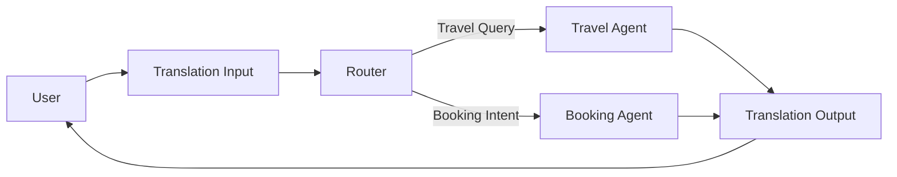

# Multi-Agent Travel Assistant - Technical Documentation

## Table of Contents
1. [Agent Communication Protocol](#1-agent-communication-protocol)
2. [State Management Approach](#2-state-management-approach)
3. [Error Handling Strategy](#3-error-handling-strategy)
4. [Trade-offs and Design Decisions](#4-trade-offs-and-design-decisions)

---

## 1. Agent Communication Protocol

### 1.1 Message Schema (A2A Protocol)

All agents communicate using a standardized **Agent-to-Agent (A2A) Message** format defined in `agents/a2a_schema.py`:

```python
class A2AMessage(BaseModel):
    message_id: str      # Unique identifier (ISO timestamp)
    timestamp: str       # When message was created
    sender: str          # Sending agent name
    receiver: str        # Target agent name
    message_type: Literal["TASK", "RESPONSE", "ERROR", "INFO"]
    content: str         # The actual message content
    context: Dict        # Metadata (search_results, detected_language, etc.)
```

### 1.2 Message Types

| Type | Purpose | Example Flow |
|------|---------|--------------|
| `TASK` | Request processing | Translation → Router: "Find flights to Delhi" |
| `RESPONSE` | Processed result | TravelAgent → Translation: "Found 5 flights..." |
| `ERROR` | Error notification | BookingAgent → Translation: "No search results to book" |
| `INFO` | Status update | Used for logging and debugging |

### 1.3 Agent Handoff Flow



**Detailed Flow:**
1. **User Input** → `translation_input_node`: Detects language, translates to English
2. **Router** → `router_node`: LLM classifies intent (travel_search vs booking)
3. **Processing** → `travel_agent_node` OR `booking_agent_node`: Handles the request
4. **Response** → `translation_output_node`: Translates back to user's language

### 1.4 Handoff Triggers

| Condition | Routes To |
|-----------|-----------|
| Active `booking_stage` (not None/complete) | Booking Agent |
| LLM classifies as "BOOKING" + has search results | Booking Agent |
| LLM classifies as "TRAVEL" or no results | Travel Agent |

---

## 2. State Management Approach

### 2.1 AgentState Definition

The unified state is defined in `graph/state.py` as a TypedDict that flows through all LangGraph nodes:

```python
class AgentState(TypedDict):
    messages: Annotated[List[BaseMessage], operator.add]  # Chat history
    a2a_log: Annotated[List[A2AMessage], operator.add]    # A2A messages
    user_language: str                                     # Detected language
    next_agent: str                                        # Router decision
    booking_context: Dict[str, Any]                        # Booking workflow state
    last_search_results: List[Dict[str, Any]]             # Search results
    search_context: str                                    # Type of search
    booking_stage: Optional[str]                           # confirm/details/payment/complete
```

### 2.2 State Propagation Rules

Each node explicitly returns the state fields it modifies. Critical preservation rules:

| Node | Modifies | Preserves |
|------|----------|-----------|
| `translation_input` | `user_language`, `a2a_log` | All others |
| `router` | `next_agent` | All others |
| `travel_agent` | `last_search_results`, `search_context`, `a2a_log` | `booking_context` if no new search |
| `booking_agent` | `booking_context`, `booking_stage`, `a2a_log` | `last_search_results` |
| `translation_output` | `messages`, `a2a_log` | All others |

### 2.3 Multi-Turn Context Handling

**Context Window:**
- **Message History**: Last 10 messages passed to LangGraph
- **Context Summary**: Last 6 messages summarized for Travel Agent LLM
- **Search Results**: Persist until replaced by new search
- **Booking Context**: Persists through entire booking flow

**Context Reference Resolution:**
The booking agent resolves references like "the first one", "cheapest", "AI-223" using:
1. Ordinal matching ("first" → index 0)
2. Superlative matching ("cheapest" → min price)
3. Identifier matching (flight number, hotel name)

### 2.4 Session State (Streamlit)

Streamlit session state mirrors AgentState for UI persistence:

```python
st.session_state.last_search_results  # Synced after each graph invocation
st.session_state.booking_context
st.session_state.booking_stage
st.session_state.user_language
```

---

## 3. Error Handling Strategy

### 3.1 Input Validation Layer

**Location:** `validation/input_guards.py`

| Check | Threshold | Action |
|-------|-----------|--------|
| Message Length | Max 500 chars | Reject with message |
| Toxic Language | 0.8 threshold | Reject with message |
| Short Greetings | ≤2 words | Bypass validation |

### 3.2 Tool Calling Error Handling

**Problem:** Groq API sometimes fails tool calls with format errors.

**Solution in `travel_agent.py`:**
```python
try:
    llm_with_tools = llm.bind_tools(TOOLS, tool_choice="auto")
    response = llm_with_tools.invoke(messages)
except Exception as tool_error:
    log_error("TravelAgent", f"Tool calling failed: {tool_error}")
    return _handle_without_tools(user_query, context, llm, system_content)
```

**Fallback Chain:**
1. Try tool calling → Success → Return results
2. Tool call fails → Try direct LLM response → Return
3. All fails → Return generic error message

### 3.3 Follow-up Question Handling

**Problem:** LLM tries to call tools for follow-up questions about existing results.

**Solution:** Detect follow-up patterns and answer from context:
```python
def _is_followup_question(query: str) -> bool:
    patterns = ["which one", "which has", "tell me more", "the first", ...]
    return any(pattern in query.lower() for pattern in patterns)
```

### 3.4 Booking Flow Error Recovery

| Error | Handling |
|-------|----------|
| No search results | "Please search for flights/hotels first" |
| Invalid item reference | "Please specify (e.g., 'book the first one')" |
| Missing details | "Please provide: [name/email/phone]" |
| Invalid card digits | "Please enter the last 4 digits of your card" |

### 3.5 LLM Response Cleanup

Raw function call artifacts are removed from responses:
```python
def _clean_response_text(text: str) -> str:
    text = re.sub(r'<function=[^>]*>[^<]*</function>', '', text)
    return text.strip()
```

---

## 4. Trade-offs and Design Decisions

### 4.1 Multi-Agent vs Single Orchestrator

**Decision:** Kept 3-agent architecture (Translation, Travel, Booking)

| Trade-off | Multi-Agent (Chosen) | Single Orchestrator |
|-----------|---------------------|---------------------|
| **Modularity** | ✅ Clear separation of concerns | ❌ Monolithic |
| **Debugging** | ✅ Easy to trace per-agent | ❌ Harder to debug |
| **Latency** | ❌ Multiple LLM calls | ✅ Single call |
| **Complexity** | ❌ State propagation needed | ✅ Simpler state |

**Rationale:** Assignment required multiple agents. The modularity benefit outweighs the latency cost for a demo system.

### 4.2 LLM-Based Router vs Keyword Matching

**Decision:** LLM classification with keyword fallback

| Approach | Pros | Cons |
|----------|------|------|
| **LLM Router** | Understands nuance, intent | Extra LLM call latency |
| **Keywords** | Fast, predictable | Brittle, misses variations |
| **Hybrid (Chosen)** | Best of both | Slight complexity |

**Implementation:**
```python
def classify_intent(user_message, state):
    if booking_stage and booking_stage not in [None, "complete"]:
        return "booking_agent"  # Deterministic for active booking
    
    try:
        result = llm.invoke(ROUTER_PROMPT)  # LLM classification
        return "booking_agent" if "BOOKING" in result else "travel_agent"
    except:
        return _fallback_intent_classification(...)  # Keyword fallback
```

### 4.3 bind_tools() vs AgentExecutor

**Decision:** Replaced AgentExecutor with direct `bind_tools()`

| Approach | AgentExecutor (Old) | bind_tools() (New) |
|----------|--------------------|--------------------|
| **Context Control** | ❌ Loses context between turns | ✅ Full control |
| **Tool Execution** | ✅ Automatic | ❌ Manual |
| **Error Handling** | ❌ Opaque failures | ✅ Explicit try/catch |
| **Complexity** | ✅ Simple setup | ❌ More code |

**Rationale:** AgentExecutor was causing context loss. Manual tool handling gives better reliability.

### 4.4 Pydantic Structured Output vs JSON Parsing

**Decision:** Use Pydantic with fallback to regex

| Approach | Structured Output | Raw JSON Parsing |
|----------|-------------------|------------------|
| **Reliability** | ✅ Type-safe | ❌ Parsing errors |
| **LLM Support** | ❌ Not all LLMs | ✅ Universal |
| **Fallback Needed** | Yes | Yes |

**Implementation in Booking Agent:**
```python
try:
    structured_llm = llm.with_structured_output(IntentResult)
    result = structured_llm.invoke(prompt)
except:
    return _fallback_intent_detection(user_input)  # Regex-based
```

### 4.5 SQLite vs PostgreSQL

**Decision:** Support both, auto-detect

| Use Case | Database | Configuration |
|----------|----------|---------------|
| Streamlit Cloud | SQLite | Default (no env var) |
| Local Development | PostgreSQL | `DATABASE_URL` in .env |
| Force SQLite Locally | SQLite | `USE_SQLITE=true` |

**Trade-off:** SQLite simplifies deployment but lacks concurrent write support. Acceptable for a demo.

### 4.6 Guardrails Library vs Custom Validation

**Decision:** Use guardrails-ai with fallback

| Aspect | guardrails-ai | Custom Validation |
|--------|---------------|-------------------|
| **Features** | Toxic detection, PII, hallucination | Basic length/content |
| **Reliability** | ❌ Windows DLL issues | ✅ Works everywhere |
| **Maintenance** | ❌ External dependency | ✅ No dependencies |

**Current Approach:** Import guardrails, wrap in try/except, fallback to permissive validation if import fails.

---

## 5. Architecture Diagram

```
┌───────────────────────────────────────────────────────────────┐
│                     Streamlit UI (main.py)                    │
│  ┌─────────────┐  ┌──────────────┐  ┌────────────────────┐   │
│  │ Chat Input  │  │ Results Grid │  │ Booking Confirmation│   │
│  └──────┬──────┘  └──────────────┘  └────────────────────┘   │
└─────────┼─────────────────────────────────────────────────────┘
          ↓
┌─────────────────────── LangGraph Workflow ─────────────────────┐
│                                                                 │
│  ┌──────────────┐    ┌────────┐    ┌─────────────────────┐    │
│  │ Translation  │ → │ Router │ → │ Travel OR Booking   │    │
│  │    Input     │    │  (LLM) │    │      Agent          │    │
│  └──────────────┘    └────────┘    └─────────────────────┘    │
│          ↑                                    ↓                │
│          │         ┌──────────────┐           │                │
│          └─────────│ Translation  │←──────────┘                │
│                    │    Output    │                            │
│                    └──────────────┘                            │
└─────────────────────────────────────────────────────────────────┘
          ↓
┌───────────────────────── Data Layer ───────────────────────────┐
│  ┌──────────────┐  ┌──────────────┐  ┌──────────────────────┐ │
│  │ PostgreSQL   │  │   SQLite     │  │ Mock Recommendations │ │
│  │ (Local/Prod) │  │ (Cloud Demo) │  │       (Static)       │ │
│  └──────────────┘  └──────────────┘  └──────────────────────┘ │
└─────────────────────────────────────────────────────────────────┘
```

---

## 6. Key Files Reference

| File | Purpose |
|------|---------|
| `graph/workflow.py` | LangGraph node definitions, routing logic |
| `graph/state.py` | AgentState TypedDict definition |
| `agents/translation_agent.py` | Language detection and translation |
| `agents/travel_agent.py` | Tool calling for search, context handling |
| `agents/booking_agent.py` | Multi-step booking workflow |
| `agents/a2a_schema.py` | A2AMessage schema |
| `validation/input_guards.py` | Input validation with guardrails |
| `tools/flights.py`, `hotels.py`, `trains.py` | Database query tools |
